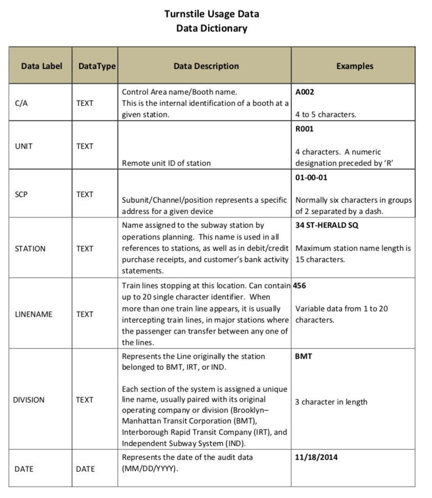
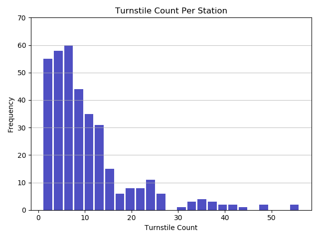
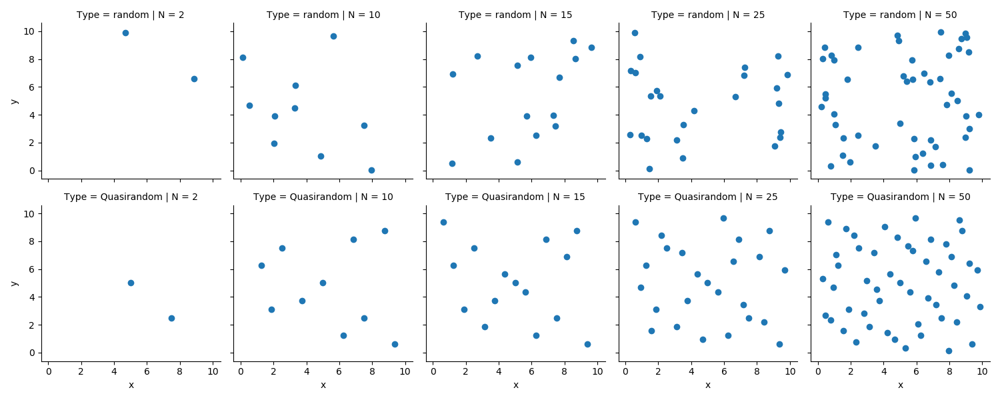
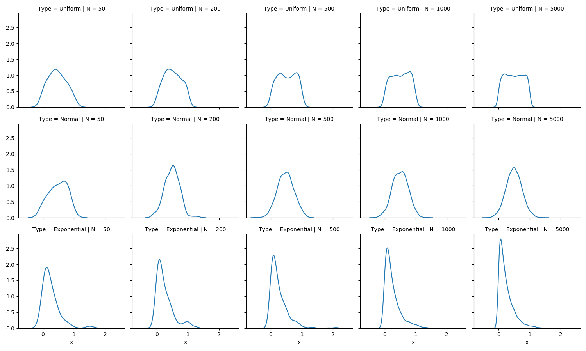
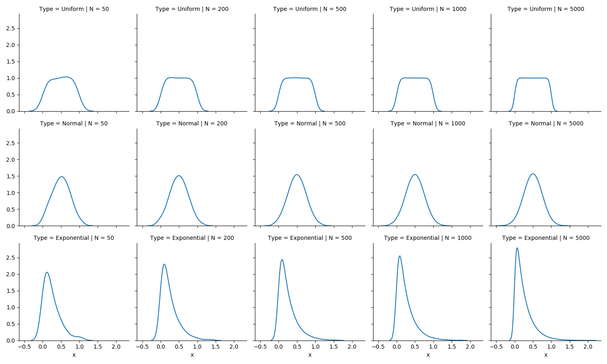

# Assignment 1 - Designing Models and Analyzing Data (Template)

Participant name: Joshua Haley

Project Title: Subway Eescalatorscalator Policies

# General Introduction

The first part of this assignment explores designing models (and basic Python/Git features). 

We will look at **subway model in a city** system. A **subway system** is an underground, tube, or metro, underground railway system used to transport large numbers of passengers within urban and suburban areas - modern subways use different types of electronic data collection sensors to supply information which is used to manage assets and resources efficiently. 

The second part of the assignment explores data analysis. Data analysis and visualization is key to both the input and output of simulations. This assignment explores different random number generators, distributions, visualizations, and statistics. Additionally, it will look at getting you accustomed to specifying input and output variables to a system. We will also practice working with real data.

# Part 1: Designing a Model - Subway System

Sticking with the initial problem of Subway escalator systems, it is interesting to us to maximize transportation throughput to maximize utility and minimize cost.  In particular, if existing infrastructure already exists, it can be very costly to build new infrastructure rather than test additional control schemes for existing systems.  This is a problem that cities currently face as infrastructure ages while population increase beyond original design. 

A more general problem is the maximization of throughput when you have multiple lanes of travel with variable directionality.  Expressways are a perfect instance of this where a road may be east to west for morning rush hour, and then reverse for afternoon rush hour. 

We will look specifically at the excolator problem in the context of a discrete agent based simulation.  The simulation should allow us to identify benefit or decrement of escalator policy. 

Hypothesis: Policy (stand only vs walking allowed) has an effect on throughput through an escalator. In particular stand only will lead to increased throughput.   The null hypothesis is that standing only will *not* lead to an increase in throughput. 

## (Part 1.1): Requirements (Experimental Design) **(10%)**
* The simulation shall allow for multiple escaescalatorlator policies (standing only vs walking lane).
* The simulation shall allow for a specific proportion of each policy to be randomly assigned. 
* The simulation shall allow for us to set a rate at which new individuals enter the escalator queue
* Ths simulation should allow for a third policy (I'm going to stand in the walking lane) to be probabilistically selected. 
* The simulation shall simulate atleast one escalator. 
* The simulation shall spatially have discretization of approximately the footprint of a single individual.
* Individuals shall not be able to simultaneously occupy the same space.
* Simulation should report number of individual through a single escalator as people per time period

## (Part 1.2) Subway Escalator Model **(10%)**
At a high level.  We will have an infinite queue of people trying to get from one side of the esolator. Individuals will have the option to get on at the standing only space, the 2nd standing space, or walking space.  Individuals will be assigned the policy of walk or stand. 

* [**Object Diagram**](model/object_diagram.md) - provides the high level overview of components for our simulation.
* [**Class Diagram**](model/class_diagram.md) - provides details of the classes to be implemented for the discrete time escalator simulation.
* [**Behavior Diagram**](model/behavior_diagram.md) - provides details of the main timestep loop of the escalator model.

## (Part 1.3) Subway Escalator Simulation **(10%)**
I will simulate the escalator using a discrete time simulation with where the escalator is is a set number of spots that can be stood in.   Starting from the end of the ecalator we will update position(s) of current occupants for each timestep and then add any additional new occupants to the escalator. 

Inputs include the proportion of walkers, policy decisions, how many standers will rudely stand in the walking lane.

Outputs incude the number of individuals per time period that traverse the escalator successfully.   
 We will run the simulation several times in different conditions to see if there are significant differences between conditions either confirming our hypothesis or the null hypothesis. 
 

## (Part 1.4) Subway City (My Problem) Model **(10%)**
[**Code template**](code/README.md) - Starting coding framework for the Subway Escalator Problem

## (Part 1.5) Specifying the Inputs to a System **(10%)**
Independent variables for the given system are:

* Policy type decision
* Proporition of walkers to standing individuals
* Proportion of standers who will stand in the walk lane
* How much space walkers keep ahead of them while walking
* Amount of individuals joining the queue during each time step.

Dependent variables are:

* Number of individuals through the escalator in a given time.
* Average size of the escalator queue 
* Average occupancy of the escalator

The dependent variables will be genreated synthetically.  Reasonable proportions for walkers vs standing individuals and standers who stand in the walk lane can be gained from empirical surveys. Ideally this will be captured over multiple observations to gain a distribution over a specified number of time that can be sampled.   In order for this to be valid, we will need to make sure we have sufficient samples and sample at different points of time so we have a non-biased statistic.   Similarly we can determine how much space walkers tend to keep ahead of them through observational survey.

Our model has probablistic elements, so it will need to be be run in several configurations allowing us to see the dependent variables with respect variability introduced by random variables. 

To visualize my data for results communication I would use a simple bar plot breaking out each condition with total throughput.  Depending on how important the occupancy over time is, I would present them as throughput overtime with representation of occupancy and queue size. 

For a flashy infographic.  I would have a pictoral representation showing the occupancy of the excalator.  I would represent relative throughput with the number of people of people at the top of an upward escalator walking away happily. I would represent queue size with numbers of frustrating individuals at the base of an upward escalator waiting to enter.   Depending on the results and the story we are trying to tell, I could change the colors to indicate frustration of people waiting with a positive color of those leaving the escalator. 

# Part 2: Creating a Model from Code

## (Part 2.1) **P**ortable **O**rganic **T**rouble-free **S**elf-watering System (**POTS**) Model **(10%)**
Here [**we provide an overview**](code/POTS_system/README.md) of the **P**ortable **O**rganic **T**rouble-free **S**elf-watering System (**POTS**) Model and provide a source code template for the code found in  [**the following folder**](code/POTS_system/). Please create a **class** diagram of this model.

# Part 3: Data Analysis

## (Part 3.1) - Real Data **(10%)**
I identified a data source from the NYC MTA that contains individual turnstile entries and exit counts from the year 2018.   Included in this report is a sampling of the first 1024 lines of the CSV based file.  (The whold data set is 822MB and is not appropriate for git)  This data is critical because in agregation it can tell us how many individuals are entering a particular subway station, as well as how many are leaving it.  This lets us build a model for the external boundary of the whole subway system, as well as a model for the flow of individuals through a single subway stations boundaries.  While rideship in aggregate is important, we need to know the relation between riders who get on at station A and then take Line X to Station B to better model the escalator entrance and exit.

**Note** Stats were calculated on the real data which can be found at: https://data.ny.gov/Transportation/Turnstile-Usage-Data-2018/bjcb-yee3, but only the first 1024 lines were included into .

Code to calculate stats is located [**the following folder**](code/MTA_Data_Munge/). With documentation[**Here**](code/MTA_Data_Munge/README.md)

Each Row contains the following information as outlined in the data dictionary:

After Loading the Data into python we can see the following:

* There are 357 different Train Stations
* There are 3813 different Turnstile Devices
* On Average each station has 10.6 turnstiles

Note: Regarding Enterance and Exit counts; Those are accumulator values that are not cleared and are sampled several times a day.  So it will need to be cleaned into a form to get true enterances/exits per day for our simulation. 

Futher analysis is required to munge the data into a form usable for a baysian based model of transit, but it has all of the information to calculate how many people are entering and exiting each station, as well as how the stations are connected together. 

## (Part 3.2) -  Plotting 2D Random Number Generators **(15%)**

This portion of the assignment looks at generating random numbers in Python and understanding how to properly plot them. Plot two different random numbers, pseudo random and quasi random, for five different N values. There should be 10 subplots, all properly formatted 2D plots. Note, each of the N points will have two coordinates, an x and a y, therefore you will need to generate two random numbers for each point. You should replace the image with your results in a simalar format. Discuss how the patterns differ. Feel free to change the N values from the suggested N values in the image to state your case.

**To Generate Quasi random numbers, we will use  sobol_seq, For Random numbers we'll just stick with Numpy's random function**

We can see from the above plot, that the Quasi-Random numbers are more evenly distributed over the space where as the random numbers do not appear to be. 

## (Part 3.3) -  Plotting 1D Random Distributions **(15%)**

Now, choose three different distributions to plot in 1D, or as a histogram. Choose a pseudo-random generator and generate three different distributions. Example distributions are Uniform (part 8), Normal, Exponential, Poisson, and Chi-Squared, but feel free to use any three distributions of your choice. Again, plot each distribution for five different Ns. This will result in 15 different subplots, formatted similar to the image in Part 8. Include your properly formmated 1D plots below and breifly describe what we are looking at and how things change as N is changed.

The three distributions chosen were Uniform, Standard (Mu = 0.5, std=0.25) and Exponential a scale of 0.25   Looking at the above, we can see as N is increased, our distribution plots better approximate the given distribution.

###Repeating with Quasirandom Numbers 

Repeat the above using a quasi-random generator . Discuss the similarities and differences.

I used Chaospy using Sobol Sampling to generate the distirbutions.  Like before, as N was increased the shape of the distribution better approached the ideal.  However, with a more spread sampling it took a lower N to reach the same result.
