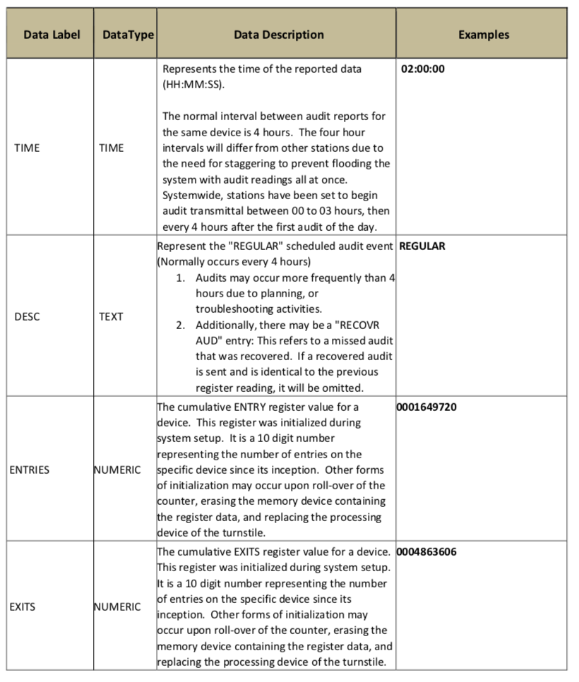

# Assignment 1 - Designing Models and Analyzing Data (Template)

Participant name: Joshua Haley

Project Title: Subway *TBD*

# General Introduction

The first part of this assignment explores designing models (and basic Python/Git features). 

We will look at **subway model in a city** system. A **subway system** is an underground, tube, or metro, underground railway system used to transport large numbers of passengers within urban and suburban areas - modern subways use different types of electronic data collection sensors to supply information which is used to manage assets and resources efficiently. 

The second part of the assignment explores data analysis. Data analysis and visualization is key to both the input and output of simulations. This assignment explores different random number generators, distributions, visualizations, and statistics. Additionally, it will look at getting you accustomed to specifying input and output variables to a system. We will also practice working with real data.

# Part 1: Designing a Model - Subway System

(remove: States your motivation clearly: why is it important / interesting to solve this problem?)

(remove: Add real-world examples, if any)

(remove: Put the problem into a historical context, from what does it originate? Are there already some proposed solutions?)

## (Part 1.1): Requirements (Experimental Design) **(10%)**

(remove: You should start by specifying a set of requirements. I specified a topic a Subway escalator. What exactly does that mean - practice formulating your own set of requirements and an experiment. Define problems cities face and hypothesize how a subway system could help alleviate these issue. This helps you think about your problem communication and system objectives inputs, functions, and outputs - they should be clearly specified.)

## (Part 1.2) Subway (My Problem) Model **(10%)**

(remove: add a high-level overview of your model, the part below should link to the model directory markdown files)
(remove: Look at the [**Object Diagram**](model/object_diagram.md) for how to structure this part of Part 2 for each diagram. Only the Object diagram has the template, the rest are blank. )

* [**Object Diagram**](model/object_diagram.md) - provides the high level overview of components
* [**Class Diagram**](model/class_diagram.md) - provides details of (what are you providing details of)
* [**Behavior Diagram**](model/behavior_diagram.md) - provides details of (what are you providing details of)
* [**Agent / User case** (if appropriate)](model/agent_usecase_diagram.md) - provides details of (what are you providing details of)

## (Part 1.3) Subway (My Problem) Simulation **(10%)**

(remove: Describe how you would simulate this - including type of simulation, rough details, inputs, outputs, and how it will help you analyze your experimental hypothesis, or nullify your null hypothesis.)

## (Part 1.4) Subway City (My Problem) Model **(10%)**
[**Code template**](code/README.md) - Starting coding framework for the (insert your exact problem here.)
You are expected to create the python files - the code should run without errors, create and object(s) for your system, but not provide function detail.

## (Part 1.5) Specifying the Inputs to a System **(10%)**

(remove the below points once ideas are satisfied)
* Specify the independent and dependent input variables of your subway esclator model
* Specify where the data will come from measured subset of real data (empirical) or synthetic data
* What kind of statistics are important to capture this input data
* How do you plan to analyze the output of your model?
* What ways will you visualize your data - charts, and graphs you will create?
* What clever way will you visualize your output with a useful infographic?

# Part 2: Creating a Model from Code

## (Part 2.1) **P**ortable **O**rganic **T**rouble-free **S**elf-watering System (**POTS**) Model **(10%)**
Here [**we provide an overview**](code/POTS_system/README.md) of the **P**ortable **O**rganic **T**rouble-free **S**elf-watering System (**POTS**) Model and provide a source code template for the code found in  [**the following folder**](code/POTS_system/). Please create a **class** diagram of this model.

# Part 3: Data Analysis

## (Part 3.1) - Real Data **(10%)**
I identified a data source from the NYC MTA that contains individual turnstile entries and exit counts from the year 2018.   Included in this report is a sampling of the first 1024 lines of the CSV based file.  (The whold data set is 822MB and is not appropriate for git)  This data is critical because in agregation it can tell us how many individuals are entering a particular subway station, as well as how many are leaving it.  This lets us build a model for the external boundary of the whole subway system, as well as a model for the flow of individuals through a single subway stations boundaries.  While rideship in aggregate is important, we need to know the relation between riders who get on at station A and then take Line X to Station B to better model the escalator entrance and exit.

**Note** Stats were calculated on the real data which can be found at: https://data.ny.gov/Transportation/Turnstile-Usage-Data-2018/bjcb-yee3, but only the first 1024 lines were included into .

Code to calculate stats is located [**the following folder**](code/MTA_Data_Munge/). With documentation[**Here**](code/MTA_Data_Munge/README.md)

Each Row contains the following information as outlined in the data dictionary:

After Loading the Data into python we can see the following:

* There are 357 different Train Stations
* There are 3813 different Turnstile Devices
* On Average each station has 10.6 turnstiles

Note: Regarding Enterance and Exit counts; Those are accumulator values that are not cleared and are sampled several times a day.  So it will need to be cleaned into a form to get true enterances/exits per day for our simulation. 

Futher analysis is required to munge the data into a form usable for a baysian based model of transit, but it has all of the information to calculate how many people are entering and exiting each station, as well as how the stations are connected together. 

## (Part 3.2) -  Plotting 2D Random Number Generators **(15%)**

This portion of the assignment looks at generating random numbers in Python and understanding how to properly plot them. Plot two different random numbers, pseudo random and quasi random, for five different N values. There should be 10 subplots, all properly formatted 2D plots. Note, each of the N points will have two coordinates, an x and a y, therefore you will need to generate two random numbers for each point. You should replace the image with your results in a simalar format. Discuss how the patterns differ. Feel free to change the N values from the suggested N values in the image to state your case.

**To Generate Quasi random numbers, we will use  sobol_seq, For Random numbers we'll just stick with Numpy's random function**

We can see from the above plot, that the Quasi-Random numbers are more evenly distributed over the space where as the random numbers do not appear to be. 

## (Part 3.3) -  Plotting 1D Random Distributions **(15%)**

Now, choose three different distributions to plot in 1D, or as a histogram. Choose a pseudo-random generator and generate three different distributions. Example distributions are Uniform (part 8), Normal, Exponential, Poisson, and Chi-Squared, but feel free to use any three distributions of your choice. Again, plot each distribution for five different Ns. This will result in 15 different subplots, formatted similar to the image in Part 8. Include your properly formmated 1D plots below and breifly describe what we are looking at and how things change as N is changed.

Repeat the above using a quasi-random generator. Discuss the similarities and differences.
