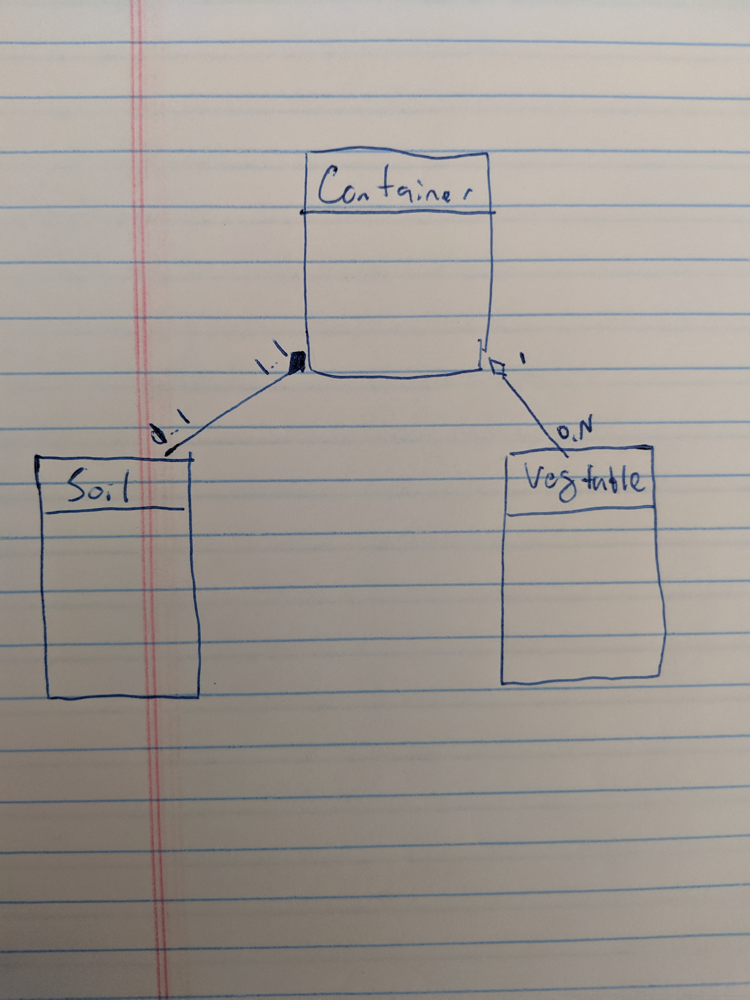

## **P**ortable **O**rganic **T**rouble-free **S**elf-watering System (**POTS**) Model

The POTS system models a self watering system which is comprised of a container, filled with a type of soil and a group of vegetables.  Every time step, the vegetables will consume water and nutrients and grow.  When water or nutrients are depleted, the vegetables will die. 

**Note: Press 'c' to add compost, and 'w' to water.  On *nix you need to press enter after hitting a key due to how python line buffers input**

My POTS System Diagram Object Diagram

My POTS (Basic) Object Diagram

From the above Object diagram, you can see there are 3 main objects involved in the simulation all with different subclasses of object:  1) Container which are filled with vegetables, soil and water.  2)  Soil which provides nutrients. 3) Vegetables which consume water and nutrients to grow. 

The Specific Objects, Object SubTypes, Methods and Fields are given in the class diagram below. 

