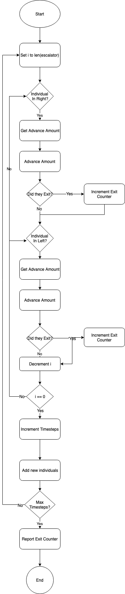

## Smart City Escolator Policy Model - Behavior Diagram

The flowchart below details the process for running a simulation of escalator's update cycle.  It iterates down an escalator for the exit to the enterance advancing individuals depending on their individual policy as well.  When it reaches the entrance of the escalator it will draw new individuals onto the escalator. 

