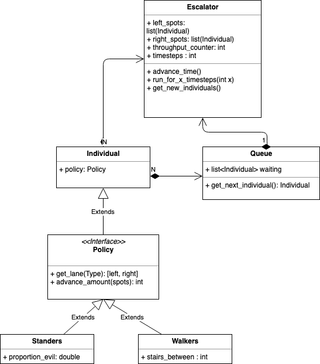

## Smart City Escolator Policy Model - Class Diagram

There are several objects of interest in our simulation.  An escalator, persons, and subway policies. 

The escolator has a single waiting queue.  The queue and the escalator both can have many individuals.  Each individual has an escalator policy.  

Of particular interest, the Policy has two types:  
Standers and Walkers.   The policy defines which of the two lanes an individual will go into and how many spots they should advance.  For standers the answer will alway be 1 due to movement of the escalator.   For walkers it depends up the stairs_between value. 
