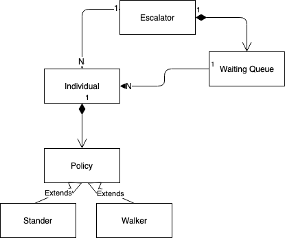

## Smart City Escolator Policy Model - Object Diagram

There are several objects of interest in our simulation.  An escalator, persons, and subway policies. 

The escolator has a single waiting queue.  The queue and the escalator both can have many individuals.  Each individual has an escalator policy.   Escalator policies have several types which will be further explored by the class diagram.